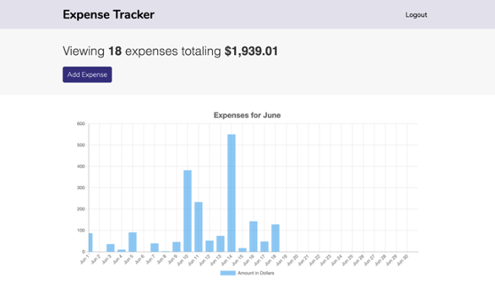
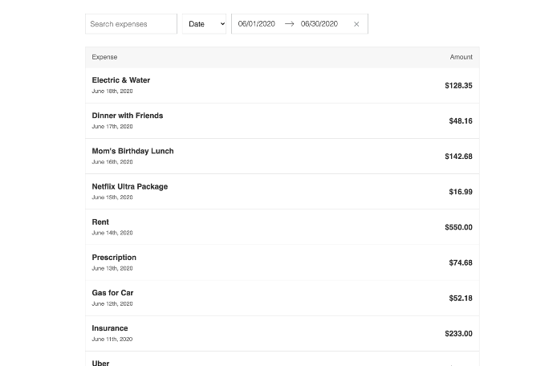
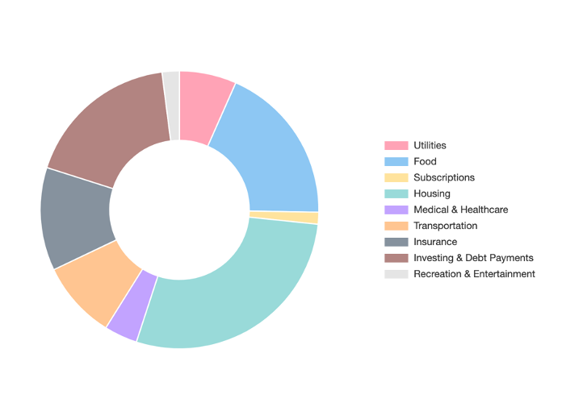

# expense-tracker
A React web app to track expenses entered by the user

  


## Installation 
1. Clone the github repository.
```
git clone https://github.com/tdsimpson/expense-tracker.git
```

2. Install the dependencies.
```
yarn install
```
3. Run development server

```
yarn run dev-server
```

The project should run on PORT 8080


## Firebase Setup

1. Go to the [Firebase console](https://console.firebase.google.com/u/0/) and create a new databse

2. Go Project Overview and create a new web app.

3. Copy the congif keys to the clipboard

4. Create an ```.env.test``` file in the root directory

5. Paste them in to the corresponding keys in the following format:
```
FIREBASE_API_KEY=[your key]
FIREBASE_API_KEY=[your key]
FIREBASE_AUTH_DOMAIN=[your key]
FIREBASE_DATABASE_URL=[your key]
FIREBASE_PROJECT_ID=[your key]
FIREBASE_STORAGE_BUCKET=[your key]
FIREBASE_MESSAGING_SENDER_ID=[your key]
FIREBASE_APP_ID=[your key]
```
